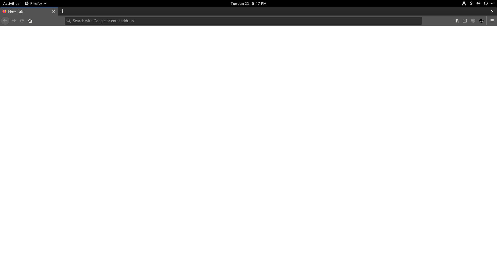
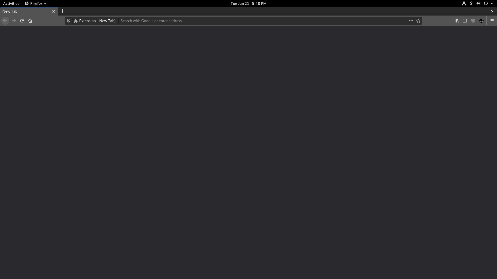

# Native New Tab for Firefox
*Eyes burning when you open about:blank?*

Firefox's new tab and homepage don't respect the "Default" theme background color unlike all other internal Firefox pages. This addon aims to rectify that by providing a new tab that uses the internal "common.css" file to style itself. (like everything else)

Also the whole *"not respecting the Default theme"* is actually a bug! Bugzilla tracker:
[https://bugzilla.mozilla.org/show_bug.cgi?id=1546540](https://bugzilla.mozilla.org/show_bug.cgi?id=1546540)

Download here: [https://addons.mozilla.org/en-US/firefox/addon/native-new-tab/](https://addons.mozilla.org/en-US/firefox/addon/native-new-tab/) (once its public)

## Screenshots
### Before

### After

### Comparison to other Firefox menus


## Building
On a UNIX system with a shell environment `env` + `sh`-like and the `zip` utility run:
```sh
./build.sh
```
To build a `firefox-native-new-tab.zip` package.

## Authors
Made with ❤ by Lua MacDougall ([lua.wtf](https://lua.wtf/))

## License
This project is licensed under [MIT](LICENSE).
More info in the [LICENSE](LICENSE) file.

*"A short, permissive software license. Basically, you can do whatever you want as long as you include the original copyright and license notice in any copy of the software/source.  There are many variations of this license in use."* - [tl;drLegal](https://tldrlegal.com/license/mit-license)
