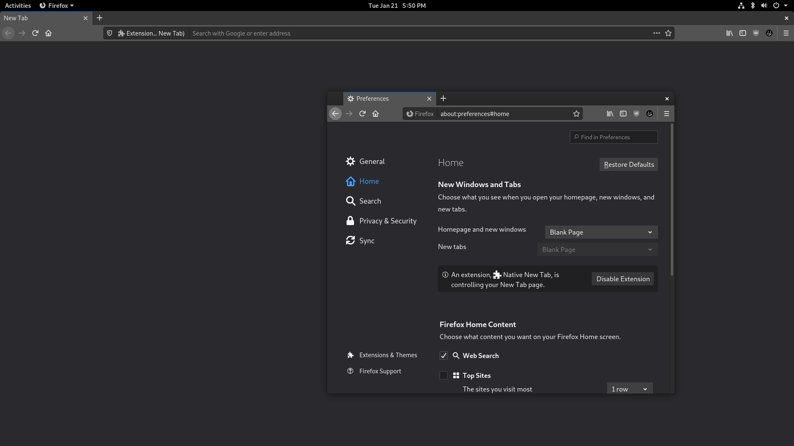

# Native New Tab for Firefox
Replaces the new tab with a completely blank page in the native background color or theme background color depending on [chrome://global/skin/in-content/common.css](chrome://global/skin/in-content/common.css).

## Screenshots
### Before

### After

### Comparison to other Firefox menus

## Authors
Made with ❤ by Lua MacDougall ([lua.wtf](https://lua.wtf/))

## License
This project is licensed under [MIT](LICENSE).
More info in the [LICENSE](LICENSE) file.

*"A short, permissive software license. Basically, you can do whatever you want as long as you include the original copyright and license notice in any copy of the software/source.  There are many variations of this license in use."* - [tl;drLegal](https://tldrlegal.com/license/mit-license)
